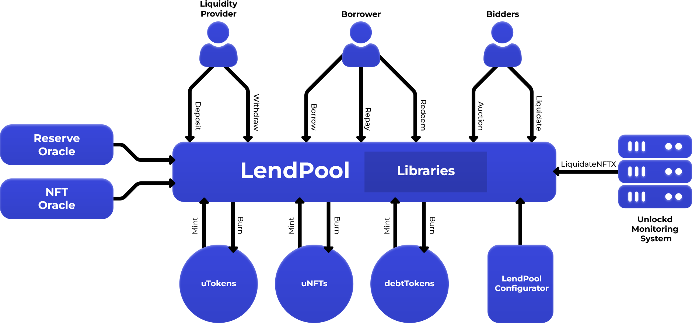

# Overview

<figure><figcaption></figcaption></figure>

## Main contracts


Both `LendPoolAddressesProvider` and `LendPoolAddressesProviderRegistry` control the upgradeability of the protocol, including asset listings and changes to protocol parameters. Unlockd token holders govern both contracts through the Unlockd Protocol Governance.


The primary contracts in Unlockd and their purposes are:

### LendPool

The LendPool contract is the main entry point into the Unlockd Protocol. Most interactions with Unlockd will happen via the LendPool, including the following functions:

* [deposit() ](lendpool.md#deposit)
* [withdraw()](lendpool.md#withdraw)
* [borrow()](lendpool.md#borrow)
* [repay()](lendpool.md#repay)
* [auction()](http://localhost:5000/o/FA1cGMnhdUOLFudN1l6H/s/I7CtufywvWjm7Lk0Eaes/)
* [buyout()](lendpool.md#buyout)
* [redeem()](lendpool.md#redeem)
* [liquidate()](http://localhost:5000/o/FA1cGMnhdUOLFudN1l6H/s/I7CtufywvWjm7Lk0Eaes/)

### LendPoolAddressesProvider

The \`LendPoolAddressesProvider\` contract serves as the main addresses register of the protocol. Developers should retrieve the latest contract addresses from this contract by making the appropriate calls.

### LendPoolAddressesProviderRegistry

This contract contains a list of `LendingPoolAddressProvider` addresses.

### uTokens

uTokens are the yield-generating, tokenized deposits used throughout the Unlockd protocol. They implement most of the standard EIP-20/ERC20 token methods with slight modifications, as well as Unlockd-specific methods, including:

* `scaledBalanceOf()`
* `getScaledUserBalanceAndSupply()`
* `scaledTotalSupply()`
* `mintToTreasury()`
* `transferUnderlyingTo()`

### Debt Tokens

Debt Tokens are the tokenized borrow positions used throughout the Unlockd protocol. Most standard EIP-20/ERC20 methods are disabled since debt tokens are non-transferable.

For more information, refer to the [Debt Tokens](debt-tokens.md) section.

## Supporting contracts

These contracts should generally not be interacted with directly but are used throughout the Unlockd Protocol via contract calls.

### LendPool Configurator

The LendPool Configurator contract provides configuration functions for the `LendPool` contracts. It also has several important functions:

* Activating / Deactivating reserves
* Enabling / Disabling borrowing for an NFT
* Enabling / Disabling using an NFT as collateral
* Freezing / Unfreezing reserves
* Updating a reserve's decimals
* Updating an NFT's Loan to Value (LTV)
* Updating an NFT's liquidation threshold
* Updating an NFT's liquidation bonus
* Updating an NFT's redeem duration
* Updating an NFT's auction duration
* Updating an NFT's min bid fine
* Updating a reserve's interest rate strategy address
* Activating / Deactivating all functions of a LendPool in emergencies

For all the above functions, relevant events are emitted on the blockchain. Developers can monitor these events to track changes in values or when values have been added or removed.

### Interest Rate Strategy

The Interest Rate Strategy contract holds the information needed to calculate and update the interest rates of specific reserves. Each contract stores the optimized base curves using the corresponding parameters of each currency. There is a mathematical function that determines the interest rate of each asset pool, with the interest rate changing based on the amount of borrowed funds and the total liquidity (i.e., utilization) of the asset pool.

The parameters for the optimized base curves are:

* `baseVariableBorrowRate`
* `variableRateSlope1`
* `variableRateSlope2`
* `stableRateSlope1`
* `stableRateSlope2`

The interest rates are calculated depending on the available liquidity and the total borrowed amount.

### Reserve Price Oracle Provider

The Reserve Price Oracle Provider contract provides reserve price data required throughout the Unlockd protocol, using Chainlink. More details can be found on the [Reserve Oracle](reserve-oracle.md) page.

### NFT Price Oracle Provider

The `NFT Price Oracle Provider` contract provides NFT price data required throughout the Unlockd protocol, using Upshot. Prices are monitored externally by the Unlockd team. More details can be found on the [NFT Oracle](nft-oracle.md) page.
